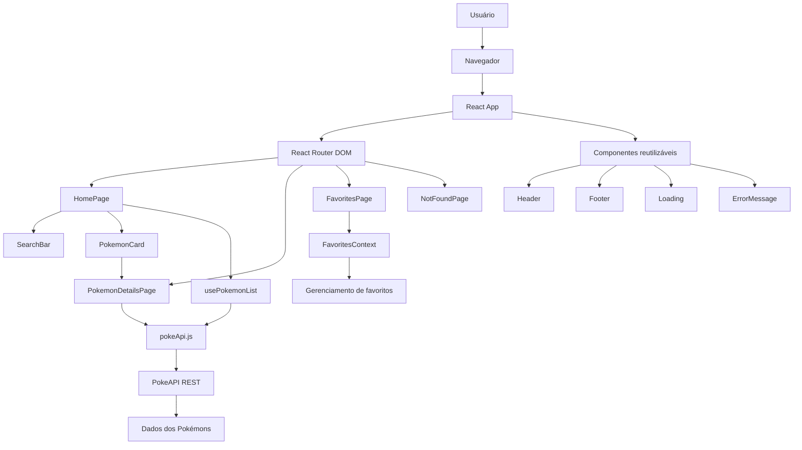

Aplicação desenvolvida em React que consome dados da API pública PokeAPI para exibir uma lista de Pokémons, detalhes individuais e uma área de favoritos.

## Link do projeto online

Acesse a aplicação publicada:

https://SEU-LINK-DA-VERCEL-AQUI.vercel.app

## Objetivo do projeto

O objetivo desta aplicação é demonstrar o consumo de uma API externa em uma aplicação React, utilizando rotas internas, rotas dinâmicas e navegação entre páginas.

## Funcionalidades

- Listagem de Pokémons consumindo dados da PokeAPI  
- Página de detalhes de cada Pokémon  
- Rotas dinâmicas com React Router  
- Links internos entre páginas  
- Página de favoritos  
- Tratamento de carregamento e erro  
- Página 404 para rotas inexistentes  

## API utilizada

A aplicação utiliza a API pública PokeAPI:

https://pokeapi.co/

Principais endpoints utilizados:

```text
https://pokeapi.co/api/v2/pokemon
https://pokeapi.co/api/v2/pokemon/{name}

## Estrutura de rotas

- `/` → página inicial com listagem e busca
- `/pokemon/:name` → página dinâmica de detalhes do pokémon
- `/favoritos` → página interna de favoritos
- `*` → página 404

## Como executar o projeto localmente

### 1) Instalar as dependências

```bash
npm install
```

### 2) Rodar em ambiente de desenvolvimento

```bash
npm run dev
```

### 3) Gerar build de produção

```bash
npm run build
```

### 4) Visualizar build localmente

```bash
npm run preview
```


## Arquitetura da aplicação



## Estrutura de pastas

```bash
pokedex-react-app/
├── public/
├── src/
│   ├── api/
│   │   └── pokeApi.js
│   ├── components/
│   │   ├── ErrorMessage.jsx
│   │   ├── Footer.jsx
│   │   ├── Header.jsx
│   │   ├── Loading.jsx
│   │   ├── PokemonCard.jsx
│   │   └── SearchBar.jsx
│   ├── context/
│   │   └── FavoritesContext.jsx
│   ├── hooks/
│   │   └── usePokemonList.js
│   ├── pages/
│   │   ├── FavoritesPage.jsx
│   │   ├── HomePage.jsx
│   │   ├── NotFoundPage.jsx
│   │   └── PokemonDetailsPage.jsx
│   ├── routes/
│   │   └── AppRoutes.jsx
│   ├── utils/
│   │   └── format.js
│   ├── App.jsx
│   ├── main.jsx
│   └── styles.css
├── index.html
├── package.json
├── vite.config.js
├── vercel.json
└── README.md
```
A aplicação foi construída em React utilizando Vite. O usuário acessa a aplicação pelo navegador, e a navegação interna é controlada pelo React Router DOM. A página inicial exibe os Pokémons consumidos da PokeAPI, enquanto as rotas dinâmicas permitem acessar a página de detalhes de cada Pokémon. O gerenciamento de favoritos é feito por meio da Context API, permitindo compartilhar o estado dos Pokémons favoritados entre diferentes páginas da aplicação.

## Explicação resumida da arquitetura

- **pages/** concentra as páginas da aplicação
- **components/** guarda componentes reutilizáveis
- **api/** centraliza o consumo da API externa
- **routes/** organiza as rotas da aplicação
- **hooks/** concentra regras reutilizáveis de busca e estado
- **context/** gerencia favoritos globalmente
- **utils/** reúne funções auxiliares de formatação


Autor

Desenvolvido por João Pedro de Carlos Silveira.
