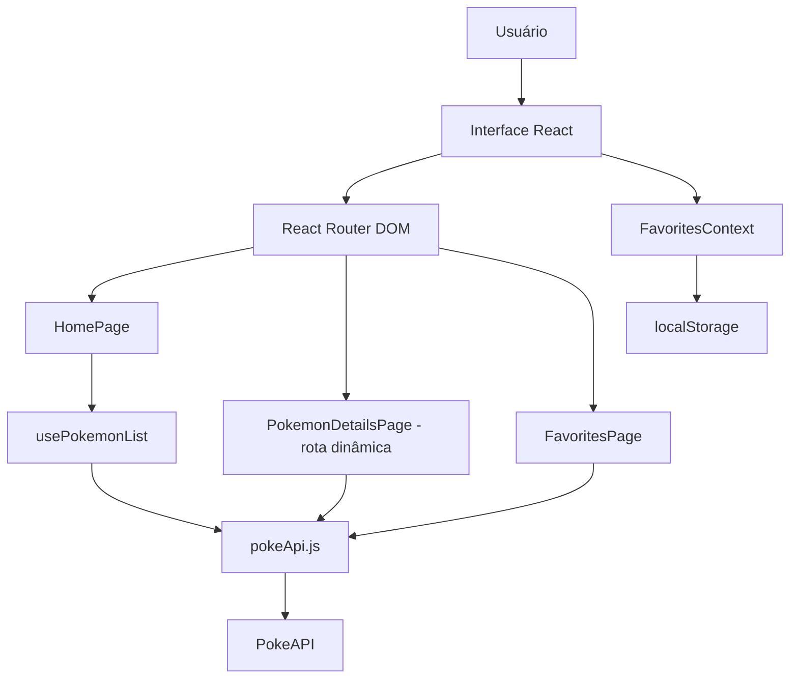

# Pokédex React

Aplicação desenvolvida em **React** com consumo de API externa (**PokeAPI**), múltiplas páginas internas, **rotas dinâmicas** e links internos entre as páginas. O projeto foi estruturado para atender a uma atividade acadêmica que exige consumo de API, organização em componentes, README completo e arquitetura documentada.

## Demonstração

Após subir o projeto em um serviço como **Vercel** ou **Netlify**, a aplicação poderá ficar online com uma URL pública.

> Exemplo de rota dinâmica implementada: `/pokemon/pikachu`

## Funcionalidades

- Listagem de pokémons consumindo dados da API externa
- Busca por nome na página inicial
- Página de detalhes com **rota dinâmica**
- Página de favoritos
- Links internos entre as páginas
- Tratamento de carregamento e erro
- Persistência simples de favoritos com `localStorage`
- Estrutura pronta para deploy

## API utilizada

- **PokeAPI**: https://pokeapi.co/

Essa API foi escolhida por ser pública, gratuita, simples de consumir e muito adequada para demonstrações de React com rotas e exibição de dados.

## Tecnologias utilizadas

- React 18
- Vite
- React Router DOM
- CSS puro
- Fetch API
- localStorage

## Estrutura de rotas

- `/` → página inicial com listagem e busca
- `/pokemon/:name` → página dinâmica de detalhes do pokémon
- `/favoritos` → página interna de favoritos
- `*` → página 404

## Como executar o projeto localmente

### 1) Instalar as dependências

```bash
npm install
```

### 2) Rodar em ambiente de desenvolvimento

```bash
npm run dev
```

### 3) Gerar build de produção

```bash
npm run build
```

### 4) Visualizar build localmente

```bash
npm run preview
```

## Como versionar corretamente com Git

```bash
git init
git add .
git commit -m "feat: cria pokedex em react com pokeapi e rotas dinamicas"
```

O projeto já acompanha um arquivo `.gitignore` adequado para React/Vite.

## Como hospedar online

### Opção 1: Vercel

1. Envie o projeto para um repositório no GitHub
2. Acesse a Vercel
3. Importe o repositório
4. A Vercel detectará automaticamente o projeto Vite
5. Faça o deploy

O arquivo `vercel.json` já foi incluído para evitar erro em rotas dinâmicas ao recarregar a página.

### Opção 2: Netlify

1. Envie o projeto para o GitHub
2. Importe no Netlify
3. Configure o build command como `npm run build`
4. Configure o publish directory como `dist`

O arquivo `netlify.toml` também foi incluído para corrigir rotas internas no deploy.

## Arquitetura da aplicação

### Desenho da arquitetura



### Organização de pastas

```text
src/
 ├─ api/
 │   └─ pokeApi.js
 ├─ components/
 │   ├─ ErrorMessage.jsx
 │   ├─ Footer.jsx
 │   ├─ Header.jsx
 │   ├─ Layout.jsx
 │   ├─ Loading.jsx
 │   ├─ PokemonCard.jsx
 │   └─ SearchBar.jsx
 ├─ context/
 │   └─ FavoritesContext.jsx
 ├─ hooks/
 │   └─ usePokemonList.js
 ├─ pages/
 │   ├─ FavoritesPage.jsx
 │   ├─ HomePage.jsx
 │   ├─ NotFoundPage.jsx
 │   └─ PokemonDetailsPage.jsx
 ├─ routes/
 │   └─ AppRoutes.jsx
 ├─ utils/
 │   └─ format.js
 ├─ App.jsx
 ├─ main.jsx
 └─ styles.css
```

## Explicação resumida da arquitetura

- **pages/** concentra as páginas da aplicação
- **components/** guarda componentes reutilizáveis
- **api/** centraliza o consumo da API externa
- **routes/** organiza as rotas da aplicação
- **hooks/** concentra regras reutilizáveis de busca e estado
- **context/** gerencia favoritos globalmente
- **utils/** reúne funções auxiliares de formatação

## Requisitos atendidos

- [x] Aplicação em React
- [x] Consumo e exibição de dados de API externa
- [x] Mais de uma página interna
- [x] Rota dinâmica com links internos
- [x] README com instruções de uso
- [x] Tecnologias documentadas
- [x] Arquitetura documentada no README
- [x] Estrutura pronta para versionamento
- [x] Estrutura pronta para deploy

## Melhorias futuras

- Paginação
- Filtros por tipo
- Comparação entre pokémons
- Tema claro/escuro
- Testes automatizados

## Autor

Projeto desenvolvido para fins acadêmicos.
